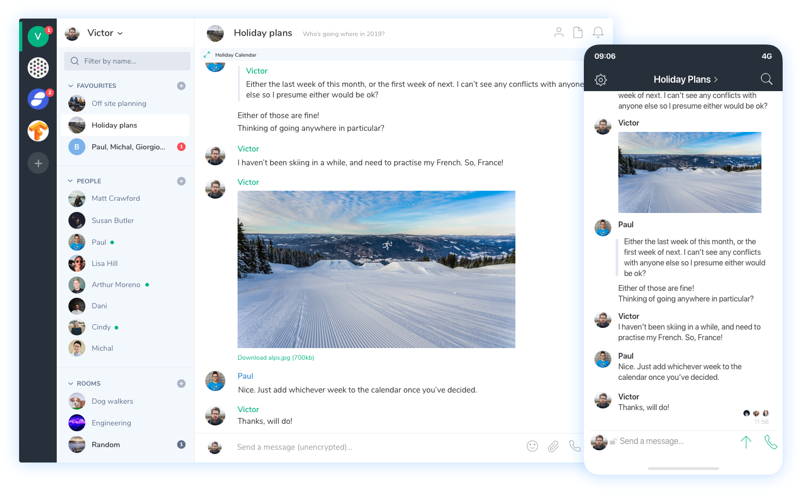

`Riot <https://about.riot.im>`_
================================

Riot could be considered the flagship Matrix client. It is made by many
of the same people that write the Matrix spec but it is just one Matrix
client. Your account works with any Matrix client. You can find many
more using `Try Matrix Now
<https://matrix.org/docs/projects/try-matrix-now.html>`_

:term:`Riot Web / Desktop`
--------------------------

Riot web is...

:term:`Riot Android`
--------------------

Riot Android is a native Matrix client for Android.

:term:`RiotX`
~~~~~~~~~~~~~

RiotX is the code name for the future version of :term:`Riot Android`.
It is a rewrite of Riot Android written in Kotlin and a new radically
different UI.

What is RiotX
^^^^^^^^^^^^^

RiotX is just the future version of Riot Android. It is a complete
rewrite to make it more performant and to completely change the
interface. RiotX is just a name to seperate it from Riot Android while
it is being developed. It will become Riot Android in the future.

:term:`Riot iOS`
----------------

Riot iOS is a native Matrix client for iOS.

